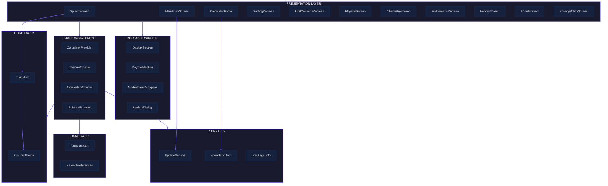
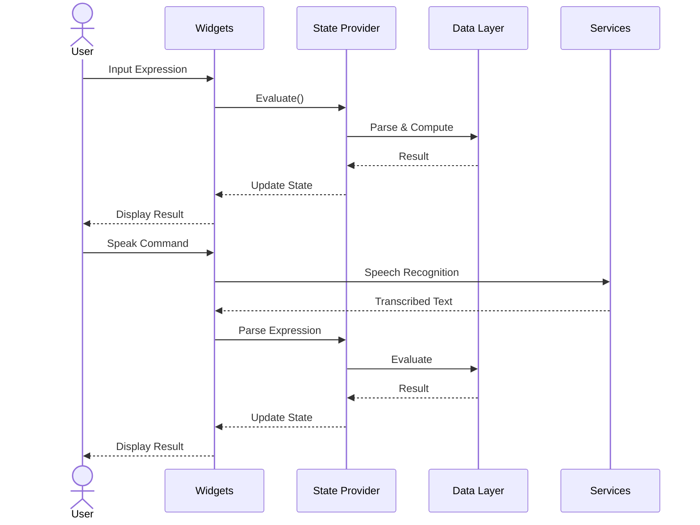

<div align="center">

# ⚡ INFICALC

### *The Infinity Scientific Calculator*

**超越极限 · 無限の計算 · 무한 계산**

[](https://flutter.dev)
[](https://dart.dev)
[](#)
[](#)
[](pubspec.yaml)

<br>

```
   ╔══════════════════════════════════════╗
   ║   ██╗███╗   ██╗███████╗██╗ ██████╗ ║
   ║   ██║████╗  ██║██╔════╝██║██╔════╝ ║
   ║   ██║██╔██╗ ██║█████╗  ██║██║      ║
   ║   ██║██║╚██╗██║██╔══╝  ██║██║      ║
   ║   ██║██║ ╚████║██║     ██║╚██████╗ ║
   ║   ╚═╝╚═╝  ╚═══╝╚═╝     ╚═╝ ╚═════╝ ║
   ║        ██████╗ █████╗ ██╗            ║
   ║        ██╔══██╗██╔══██╗██║            ║
   ║        ██████╔╝███████║██║            ║
   ║        ██╔══██╗██╔══██║██║            ║
   ║        ██║  ██║██║  ██║███████╗       ║
   ║        ╚═╝  ╚═╝╚═╝  ╚═╝╚══════╝       ║
   ╚══════════════════════════════════════╝
```

</div>

---

## 🌌 OVERVIEW

**InfiCalc** is a next-generation, cross-platform scientific calculator engineered for the modern era. It fuses advanced mathematical computation, real-time voice synthesis, multi-category unit conversion, and a deep library of physics, chemistry, and mathematics formulas — all wrapped in a cybernetic UI with adaptive theming.

> _"Not just a calculator — a computational companion."_

---

## ✨ QUANTUM FEATURES

### 🔢 Computation Engine
- **Dual-Mode Calculator** — Standard & Scientific with full expression parsing
- **Math Expression Parser** — Powered by `math_expressions` with safe evaluation
- **Smart Result Formatting** — Auto-truncation of trailing zeros, infinity/NaN handling
- **Trigonometric Flexibility** — Degrees / Radians angle base switching
- **Precision Control** — Configurable decimal precision

### 🎙️ Voice Synthesis
- **Speech-to-Expression** — Converts natural language ("plus", "times", "divided by") into math symbols
- **Real-time Recognition** — Powered by `speech_to_text` with permission handling
- **Instant Calculation** — Voice input evaluated immediately

### 🔄 Unit Conversion Matrix
| Category     | Categories Covered                          |
|-------------|---------------------------------------------|
| 📏 Length   | mm, cm, m, km, in, ft, yd, mi               |
| ⚖️ Mass      | mg, g, kg, oz, lb, ton                      |
| 💨 Speed     | m/s, km/h, mph, knot                        |
| ⏱️ Time      | ms, s, min, hr, day, week, month, year      |
| 📐 Volume    | mL, L, gal, qt, pt, cup, fl oz              |
| 🌡️ Temperature | Celsius, Fahrenheit, Kelvin               |
| 🟦 Area      | mm², cm², m², ha, km², in², ft², ac, mi²   |
| 💾 Data      | B, KB, MB, GB, TB, PB                       |
| 🔄 Pressure  | Pa, kPa, MPa, bar, psi, atm, torr           |
| ⚡ Energy     | J, kJ, cal, kcal, Wh, kWh, eV               |

### 🧬 Science Formula Vault
- **Physics** — Kinematics, dynamics, energy, waves, electromagnetism
- **Chemistry** — Stoichiometry, gas laws, thermodynamics, atomic structure
- **Mathematics** — Algebra, geometry, trigonometry, calculus, statistics
- **Metadata-Rich** — Each formula includes descriptions, variables, and validation
- **Error-Safe** — Sandboxed evaluation with graceful failure

### 🎨 Cybernetic UI
- **3 Palette Presets** — Iconic (Blue/Teal), Slate (Steel/Purple), Nebula (Violet/Pink)
- **Adaptive Interface** — Light / Dark / Auto mode
- **Space Grotesk & Inter Typography** — Futuristic type hierarchy
- **Haptic Feedback** — Tactile response toggle
- **System-Wide Edge-to-Edge** — Immersive display on supported devices

### 🛠️ System Integration
- **In-App Updates** — Android Play Store update checks via `in_app_update`
- **Persistent Settings** — All preferences stored via `SharedPreferences`
- **History Log** — Auto-saved calculation history
- **Version Tracking** — Build info via `package_info_plus`

---

## 🏗️ ARCHITECTURE



### Data Flow



---

## 📂 DIRECTORY NEXUS

```
┌── lib/
│   ├── main.dart                    # App ignition, orientation lock, provider registry
│   ├── core/
│   │   └── theme.dart               # CosmicTheme — 3 palettes, adaptive theming engine
│   ├── data/
│   │   └── formulas.dart            # Formula models, metadata, safe evaluation
│   ├── providers/
│   │   ├── calculator_provider.dart  # Expression building, history, evaluation
│   │   ├── theme_provider.dart       # Palette, mode, precision, haptics state
│   │   ├── converter_provider.dart   # Unit conversion state machine
│   │   └── science_provider.dart     # Formula category & selection state
│   ├── screens/
│   │   ├── splash_screen.dart        # Quantum boot sequence
│   │   ├── main_entry_screen.dart    # Hub portal with update checks
│   │   ├── calculator_home.dart      # Primary calculator with voice integration
│   │   ├── settings_screen.dart      # Preference matrix
│   │   ├── unit_converter_screen.dart# Cross-unit translation
│   │   ├── physics_screen.dart       # Physics formula interface
│   │   ├── chemistry_screen.dart     # Chemistry formula interface
│   │   ├── mathematics_screen.dart   # Math formula interface
│   │   ├── history_screen.dart       # Calculation archive
│   │   ├── about_screen.dart         # App intel
│   │   └── privacy_policy_screen.dart# Legal nexus
│   ├── services/
│   │   └── update_service.dart       # Android in-app update orchestrator
│   └── widgets/
│       ├── display_section.dart      # Expression & result display
│       ├── keypad_section.dart       # Dynamic keypad grid
│       ├── calculator_button.dart    # Haptic-enabled button primitive
│       ├── mode_screen_wrapper.dart   # Shared screen chrome
│       ├── formula_info_card.dart    # Formula detail card
│       └── update_dialog.dart        # Update notification modal
├── assets/
│   └── images/
│       └── app_icon.png              # Application icon
├── test/                             # Test suite
├── android/                          # Android platform layer
├── ios/                              # iOS platform layer
├── web/                              # Web platform layer
├── windows/                          # Windows platform layer
├── macos/                            # macOS platform layer
├── linux/                            # Linux platform layer
└── pubspec.yaml                      # Dependency manifest
```

---

## 🧪 TECHNOLOGY STACK

| Layer          | Technology                              |
|---------------|-----------------------------------------|
| Framework     | Flutter 3.11+ / Dart 3.11+              |
| State         | Provider (ChangeNotifier)                |
| Parsing       | `math_expressions`                       |
| Persistence   | `shared_preferences`                     |
| Voice         | `speech_to_text` + `permission_handler` |
| Updates       | `in_app_update`                          |
| Typography    | Google Fonts (Space Grotesk + Inter)    |
| Packaging     | `package_info_plus`                      |
| Markdown      | `flutter_markdown`                       |
| Icons         | `cupertino_icons`                        |

---

## 🚀 DEPLOYMENT

```bash
# Initialize
flutter pub get

# Development
flutter run

# Production builds
flutter build apk          # Android
flutter build ios          # iOS
flutter build web          # Web
flutter build windows      # Windows
flutter build macos        # macOS
flutter build linux        # Linux
```

---

## ⚙️ CONFIGURATION MATRIX

| Setting             | Type      | Persistence | Scope      |
|--------------------|-----------|-------------|------------|
| Palette Preset     | Enum      | SharedPrefs | Global     |
| Interface Mode     | Enum      | SharedPrefs | Global     |
| Decimal Precision  | Integer   | SharedPrefs | Global     |
| Trig Angle Base    | Enum      | SharedPrefs | Global     |
| Notation           | Enum      | SharedPrefs | Global     |
| Haptic Feedback    | Boolean   | SharedPrefs | Global     |
| Click Sounds       | Boolean   | SharedPrefs | Global     |
| History Auto-Save  | Boolean   | SharedPrefs | Global     |

---

## 🔮 ROADMAP

```
[████████░░] Core Calculator       — Complete
[████████░░] Voice Input           — Complete
[████████░░] Unit Converter        — Complete
[████████░░] Science Formulas      — Complete
[████████░░] Theme System          — Complete
[█████░░░░░] Graphing Calculator   — Planned
[█████░░░░░] Custom Formulas       — Planned
[███░░░░░░░] Cloud Sync            — Planned
[██░░░░░░░░] Widget/Complication   — Planned
[█░░░░░░░░░] AI Assistant          — Research
```

---

## 📦 DEPENDENCIES

```
cupertino_icons    ^1.0.8     iOS-style icons
google_fonts       ^8.0.2     Space Grotesk & Inter typefaces
provider           ^6.1.5     State management framework
math_expressions   ^3.1.0     Expression parsing & evaluation
shared_preferences ^2.5.5     Persistent local storage
package_info_plus  ^9.0.1     Version & build metadata
speech_to_text     ^7.0.0     Voice recognition engine
permission_handler ^12.0.1    Runtime permission requests
in_app_update      ^4.2.3     Android Play Store updates
flutter_markdown   ^0.7.7     Markdown rendering
```

---

## 📜 LICENSE

Proprietary — All rights reserved. Unauthorized reproduction or distribution prohibited.

---

<div align="center">
  <sub>⚡ Built with Flutter · Maintained by the InfiCalc Development Team</sub>
  <br>
  <sub>📱 Cross-Platform · 🎙️ Voice-Activated · 🧬 Science-Ready</sub>
</div>
